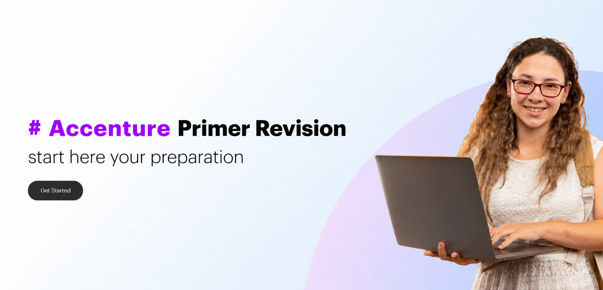

# Accenture Primer Revision

This repository is a personal revision tracker for the Accenture Primer program. It is organized by course type and contains structured notes, study goals, and progress tracking for each topic area.

## Repository structure

```text
accenture-primer-revision/
├── README.md
├── .gitignore
├── LICENSE
├── essentials/
│   ├── 01-software-fundamentals/
│   │   ├── README.md
│   │   └── notes.md
│   ├── 02-web-technologies/
│   │   ├── README.md
│   │   └── notes.md
│   ├── 03-gen-ai/
│   │   ├── README.md
│   │   └── notes.md
│   └── 04-agile-devops-devsecops/
│       ├── README.md
│       └── notes.md
└── electives/
    ├── 01-aws/
    │   ├── README.md
    │   └── notes.md
    ├── 02-mysql-relational-databases/
    │   ├── README.md
    │   └── notes.md
    └── 03-python-programming/
        ├── README.md
        └── notes.md
```

## How to use this repo

1. Start with the course overview in each module folder.
2. Review the topics and learning goals in that course's README.
3. Add revision notes in the corresponding notes.md file.
4. Update the progress tracker below as you complete each course.

## Progress tracker

| Course | Type | Status | Notes |
| --- | --- | --- | --- |
| Software Fundamentals | Essentials | Not started | Add revision notes and key concepts |
| Web Technologies | Essentials | Not started | Add HTML, CSS, JS, networking concepts |
| Gen AI | Essentials | Not started | Add prompts, models, safety, and AI concepts |
| Agile, DevOps & DevSecOps | Essentials | Not started | Add CI/CD, security, team workflows |
| AWS | Elective | Not started | Add core AWS services and architecture |
| MySQL Relational Databases | Elective | Not started | Add SQL, schema, queries, normalization |
| Python Programming | Elective | Not started | Add fundamentals, syntax, automation |

## 🌱 Getting Started

## Essentials

- [Software Fundamentals](essentials/01-software-fundamentals/README.md)
- [Web Technologies](essentials/02-web-technologies/README.md)
- [Gen AI](essentials/03-gen-ai/README.md)
- [Agile, DevOps & DevSecOps](essentials/04-agile-devops-devsecops/README.md)

## Electives

- [AWS](electives/01-aws/README.md)
- [MySQL Relational Databases](electives/02-mysql-relational-databases/README.md)
- [Python Programming](electives/03-python-programming/README.md)

## Suggested workflow

- Review each module README for objectives and priority topics.
- Capture summary notes in the corresponding notes.md file.
- Revisit harder sections and mark progress once confident.
- Keep this repository as a single source for exam prep and revision reminders.
