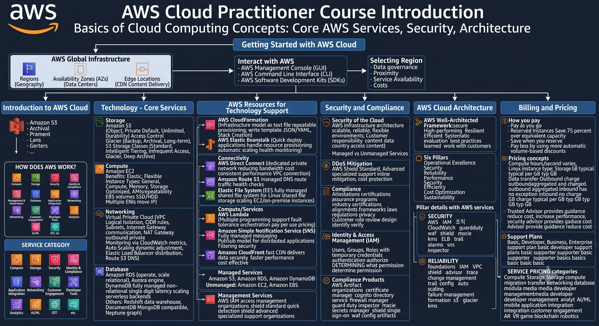

# Course: AWS

- **Category:** Electives
- **Focus Area:** AWS CLI
- **Level:** Intermediate
- **Status:** ✅ Completed

## Roadmap

## Topics Covered

1. Introduction to AWS Cloud
   - AWS Cloud Practitioner Course Introduction
   - How Does AWS Work? (Service Categories Overview)
   - The Expense Advantage (CapEx vs Pay-as-you-go)
   - AWS Global Infrastructure (Region, Availability Zone, Edge Locations)
   - Selecting a Region
   - Ways to Interact with AWS (Console, CLI, SDKs)
2. Technology — Core Services
   - Amazon S3 (Storage, Access Control, Bucket Properties, Storage Classes)
   - Amazon Glacier (Archive & Vault)
   - Amazon EC2 (Server Types, Benefits, Instance Naming, Instance Type Families)
   - Amazon EC2 and AMI
   - Amazon Elastic Block Store (EBS) — SSD & HDD Volume Types
   - Amazon VPC (Definitions, Deployment, Limitations, Subnets)
   - Internet Gateway & NAT Gateway
   - Elastic Network Interfaces (ENI)
   - Security Groups & Network ACLs
   - Monitoring & Autoscaling (CloudWatch, Dynamic Scaling, Elastic Load Balancer, ALB, NLB)
   - Amazon RDS, Aurora, DynamoDB
   - Other Purpose-Built Databases (Redshift, DocumentDB, Neptune)
3. AWS Resources for Technology Support
   - AWS CloudFormation
   - AWS Elastic Beanstalk
   - AWS Direct Connect
   - Amazon Route 53
   - Amazon Elastic File System (EFS)
   - AWS Lambda
   - Amazon Simple Notification Service (SNS)
   - Amazon CloudFront
   - Amazon ElastiCache
4. Security and Compliance
   - Security of the Cloud (Foundation Services & Global Infrastructure)
   - Managed vs Unmanaged Services
   - Security and Compliance Products
   - AWS Identity and Access Management (IAM) — User, Group, Role
   - Authentication vs Authorization
   - Amazon Inspector
   - DDoS Attacks & AWS Shield (Standard vs Advanced)
   - AWS Compliance & Customer Responsibility
5. AWS Cloud Architecture
   - AWS Well-Architected Framework
   - Six Pillars (Operational Excellence, Security, Reliability, Performance Efficiency, Cost Optimization, Sustainability)
   - Security Pillar Breakdown
   - Reliability Pillar Breakdown
6. Billing and Pricing
   - How You Pay for AWS (Pay-as-you-go, Reserved, Volume Discounts)
   - Pricing Concepts (Compute, Storage, Data Transfer)
   - Service Pricing Categories
   - AWS Trusted Advisor
   - AWS Support Plans

## Key Takeaways

- AWS organizes infrastructure into Regions, Availability Zones, and Edge Locations — region selection depends on governance, latency, service availability, and cost.
- Core compute/storage/network building blocks are EC2 (compute), S3 (object storage), EBS (block storage), and VPC (networking isolation).
- Security Groups are stateful (allow return traffic automatically); Network ACLs are stateless (need explicit inbound and outbound rules).
- The Shared Responsibility Model splits duties: AWS secures "the cloud" (infrastructure), the customer secures "in the cloud" (data, access, configuration).
- The AWS Well-Architected Framework rests on six pillars: Operational Excellence, Security, Reliability, Performance Efficiency, Cost Optimization, and Sustainability.
- AWS pricing follows three core models: pay-as-you-go, save when you reserve (Reserved Instances), and pay less by using more (volume discounts).

## Revision Notes

Full detailed notes: [notes.md](#/electives/01-aws/notes)