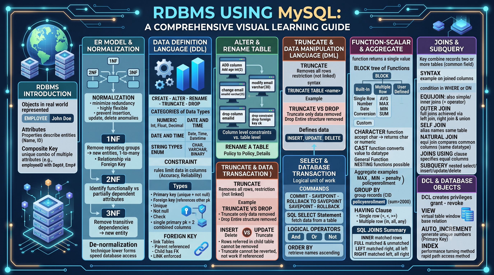

# Course: Mastering Relational Databases with MySQL

- **Category:** Electives
- **Focus Area:** Database Management
- **Level:** Intermediate
- **Status:** ✅ Completed

## Roadmap

## Topics Covered

1. RDBMS Concepts
   - Introduction to RDBMS
2. ER and Normalization
   - Entities & Attributes
   - Composite Key
   - Normalization (Goals)
   - First Normal Form (1NF)
   - Second Normal Form (2NF)
   - Third Normal Form (3NF)
   - Denormalization
3. Data Definition Language (DDL)
   - DDL Commands (CREATE, ALTER, RENAME, TRUNCATE, DROP)
   - Data Types (Numeric, Date & Time, String)
   - Constraints (Primary Key, Foreign Key, Unique, Not Null, Check)
   - Foreign Key (Parent/Child Tables)
   - ALTER Command (with examples)
   - RENAME TABLE
   - TRUNCATE (and Truncate vs Drop)
4. Data Manipulation Language (DML)
   - INSERT, UPDATE, DELETE, SELECT
   - Delete vs Truncate
   - Database Transactions (COMMIT, SAVEPOINT, ROLLBACK, ROLLBACK TO SAVEPOINT)
5. SQL Select Statement
   - SELECT Statement
   - Logical Operators (AND, OR, NOT)
   - ORDER BY Clause
6. Function — Scalar & Aggregate
   - What is a Function?
   - SQL Function Hierarchy (Single-Row vs Multiple-Row vs User-Defined)
   - Character, Number, Date, Nesting, Cast, and General Functions
   - NULLIF and IFNULL
   - Aggregate Functions (MAX, MIN, SUM, AVG)
   - GROUP BY Clause
   - HAVING Clause
7. Joins & Subquery
   - JOIN Keyword & Syntax
   - Equijoin
   - Outer Join (Left, Right)
   - Self Join
   - Natural Join
   - Joins with the USING Clause
   - Subquery (Single-row vs Multiple-row)
   - SQL Joins Summary (Inner, Full Outer, Left Outer, Right Outer)
8. DCL & Database Objects
   - Data Control Language (GRANT, REVOKE)
   - VIEW
   - AUTO_INCREMENT
   - INDEX

## Key Takeaways

- Normalization (1NF → 3NF) systematically removes data redundancy and prevents update/insertion/deletion anomalies; denormalization trades some of that back for speed.
- DDL (structure: CREATE, ALTER, TRUNCATE, DROP) is distinct from DML (data: INSERT, UPDATE, DELETE, SELECT) — DDL auto-commits by default, DML does not.
- TRUNCATE removes all rows and can't be reverted or used on referenced tables; DROP removes the entire structure; DELETE can target specific rows and can be rolled back.
- Transactions guarantee consistency through COMMIT (make permanent) and ROLLBACK (discard), with SAVEPOINT allowing partial rollbacks.
- SQL functions split into single-row (character, number, date, conversion) and multiple-row/aggregate (AVG, MAX, MIN, SUM) — GROUP BY groups rows for aggregation, HAVING filters those grouped results.
- JOINs combine data across tables — Equi/Inner, Outer (Left/Right), Self, and Natural joins each serve a different relationship pattern; MySQL doesn't support FULL JOIN natively.

## Revision Notes

Full detailed notes: [notes.md](./notes.md)

> **Note on Module 1 (RDBMS Concepts):** The source notepad listed "RDBMS Introduction" as a section header, then moved directly into the ER Model & Normalization content without separate introductory material. This section is marked as a placeholder in `notes.md` so the structure matches your 8-module format exactly — share more detail (e.g., what RDBMS is, ACID properties, RDBMS vs DBMS) whenever you have it.