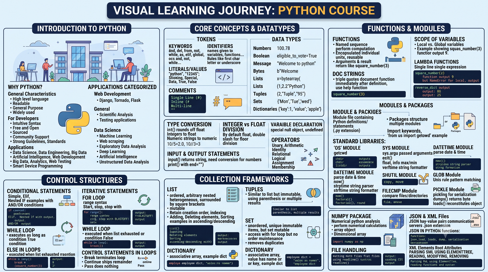

# Course: Programming using Python

- **Category:** Electives
- **Focus Area:** Python Programming
- **Level:** Beginner
- **Status:** ✅ Completed

## Roadmap

## Topics Covered

1. Introduction to Python
   - Why Python? & Applications of Python
   - Tokens (Keywords, Identifiers, Operations, Literals)
   - Comments (Single-line, Inline, Multi-line)
   - Data Types (Numbers, Boolean, Strings, Bytes/ByteArray, Lists, Tuples, Sets, Dictionaries)
   - Type Conversion & None
   - Integer vs Float Division
   - Input & Output Statements
   - Types of Operators
2. Control Structures
   - Conditional Statements (if/else, single-line, elif, nested, AND/OR)
   - Iterative Statements (for loop, range, cumulative loops, while loop, else-in-loops, nested loops)
   - Control Statements in Loops (break, continue, pass)
3. Collection Frameworks
   - List (creation, append, delete, sort, sorted)
   - Tuples
   - Set
   - Dictionary
4. Functions and Modules
   - Functions & Doc Strings
   - Scope of Variables (Local vs Global)
   - Lambda Functions
   - Python Modules & Packages
   - Standard Libraries (os, sys, datetime, math, shutil, filecmp, glob, pickle)
   - NumPy Package (Array Characteristics & Dimensions)
5. File Handling
   - Working with Files & Reading Flat Files
   - Sample Program (CSV processing)
   - JSON and XML Files
   - JSON in Python (load, loads, dump)
   - XML File Structure (Elements, Root, Attributes)
   - Parsing XML using ElementTree
   - Reading, Modifying, and Removing XML Elements
6. Code Analysis and Debugging

## Key Takeaways

- Python is a high-level, readable, general-purpose language used across Web Development, Data Science, Big Data, and AI.
- Python has 7 core built-in data structures: Numbers, Boolean, Strings, Bytes/ByteArray, Lists, Tuples, Sets, and Dictionaries — each with different mutability and ordering rules.
- Division in Python 3 always returns a float (`/`) unless you use floor division (`//`), which discards the fractional part.
- Lists and Dictionaries are mutable; Tuples are immutable; Sets are unordered and automatically remove duplicates.
- Variable scope follows Local vs Global rules — a variable defined inside a function stays local unless explicitly declared otherwise.
- Modules and packages (like `os`, `sys`, `math`, `numpy`) extend Python's core functionality — imported using the `import` keyword, and installed via `pip install`.
- Python handles structured file formats (CSV, JSON, XML) with dedicated built-in and third-party libraries.

## Revision Notes

Full detailed notes: [notes.md](./notes.md)

> **Note on Module 6 (Code Analysis and Debugging):** The source notepad did not include dedicated content for this module — it covered Introduction, Control Structures, Collection Frameworks, Functions & Modules, and File Handling in depth, but debugging/code analysis wasn't detailed separately. This section is marked as a placeholder in `notes.md` so the structure matches your 6-module format exactly — share notes on debugging tools (e.g. pdb, try/except patterns, linters) whenever you have them.