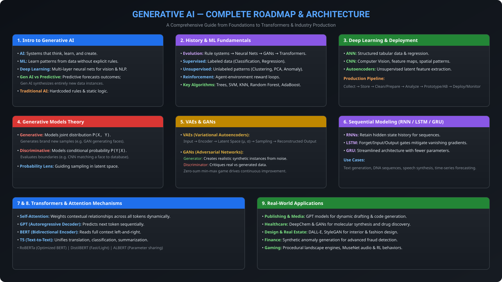

# Course: Gen AI

- **Category:** Essentials
- **Focus Area:** Generative Adversarial Network
- **Level:** Beginner
- **Status:** ✅ Completed

## Roadmap

## Topics Covered

1. Introduction to Generative AI
   - AI, Machine Learning, Deep Learning, Generative AI definitions
   - Gen AI vs Traditional AI
   - Gen AI vs Predictive AI
2. Brief History of Generative AI
3. Fundamentals of Machine Learning and Neural Networks
   - Types of Machine Learning (Supervised, Unsupervised, Semi-Supervised, Reinforcement)
   - How Supervised, Unsupervised & Reinforcement Learning work
   - Common ML Algorithms
   - ML Model Deployment lifecycle
   - Deep Learning & its applications
   - Neural Networks
4. Introduction to Generative Models
   - Generative vs Discriminative Models
   - Facial Recognition example (Generative vs Discriminative)
   - Probability Distributions
   - What a Generative Model is and is not
5. Variational Autoencoders (VAEs)
6. Generative Adversarial Networks (GANs)
7. Sequence Generation with RNNs
   - RNN fundamentals
   - LSTM (Long Short-Term Memory)
   - GRU (Gated Recurrent Unit)
8. Transformers and Attention Mechanisms
   - Transformer Architecture (Encoder, Decoder)
   - Attention Mechanism
   - Transformers in Action (BERT, GPT, T5, Transformer-XL, RoBERTa, DistilBERT, CLNet, ALBERT)
9. Generative AI in Industry and Real-World Applications
   - Publishing & Media
   - Healthcare
   - Fashion & Design
   - Real Estate
   - Finance & Banking
   - Dynamic Game Development

## Key Takeaways

- Generative AI creates new content (images, music, text) by learning from vast data — unlike traditional AI, which relies on rule-based systems, and predictive AI, which forecasts outcomes from historical data.
- Machine Learning has four core learning paradigms: Supervised, Unsupervised, Semi-Supervised, and Reinforcement Learning.
- Generative models learn the joint probability `p(X, Y)`, while discriminative models learn the conditional probability `P(Y | X)`.
- RNNs (and their LSTM/GRU variants) handle sequential data by retaining memory of past inputs — the foundation for sequence generation.
- Transformers replaced RNNs for most modern NLP tasks by using attention mechanisms to focus on relevant parts of the input, powering models like BERT and GPT.
- Generative AI is already applied across industries — publishing, healthcare, fashion, real estate, finance, and gaming — each with its own specialized tools and models.

## Revision Notes

Full detailed notes: [notes.md](./notes.md)

> **Note on modules 2, 5, and 6:** The source notepad included these as section headers ("Brief History of Generative AI", "Variational Autoencoders (VAEs)", "Generative Adversarial Networks (GANs)") but moved directly to the next topic without further detail under them. These sections are marked as placeholders in `notes.md` so the structure matches your 9-module format exactly — share more detail on these topics whenever you have it, and they'll be filled in.