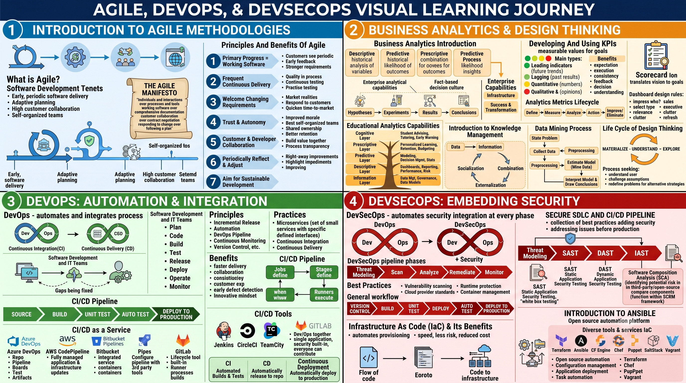

# Course: Agile, DevOps & DevSecOps

- **Category:** Essentials
- **Focus Area:** Security Compliance
- **Level:** Intermediate
- **Status:** ✅ Completed

## Roadmap

## Topics Covered

1. Introduction to Agile
   - What is Agile?
   - The Agile Manifesto
   - Principles and Benefits of Agile (7 principles)
2. Business Analytics and Design Thinking
   - Business Analytics Introduction (Descriptive, Predictive, Prescriptive)
   - Enterprise Analytical Capabilities
   - Fact-Based Decision Making Culture & the Scientific Method
   - The 5 Analytics Layers (Information, Descriptive, Predictive, Prescriptive, Cognitive)
   - Business Analytics Capabilities
   - Business Performance Management
   - Impact of BAO on Diverse Industries
   - Business Analytics Architecture
   - Introduction to Knowledge Management & Knowledge Creation Process
   - Data Mining Process
   - Developing and Using KPIs
   - Balanced Scorecard
   - Analytics Metrics Lifecycle Process
   - Categorizing Dashboards & Dashboard Design Rules
   - Design Thinking & its Life Cycle
3. DevOps
   - CI/CD Introduction
   - What is DevOps? & Need for DevOps
   - Development vs Operations (Before/After DevOps)
   - DevOps Principles
   - DevOps Phases
   - Benefits of DevOps
   - DevOps Practices (Microservices, CI, CD, Continuous Deployment)
   - CI/CD Tools (Jenkins, CircleCI, TeamCity, Bamboo, GitLab)
   - CI/CD as a Service (Azure Pipelines, AWS CodePipeline, Bitbucket Pipelines, GitLab Pipelines)
   - CI/CD Pipeline Structure (Jobs, Stages, Runners)
4. DevSecOps
   - Why DevOps? (Recap)
   - DevOps Principles — CAMS
   - CI/CD Workflow Recap
   - What is DevSecOps?
   - DevSecOps Best Practices
   - DevSecOps Pipeline Phases
   - Secure SDLC and CI/CD Pipeline
   - Embedding Security in CI/CD (SAST, DAST, IAST, SCA)
   - Software Component Analysis
   - Static Application Security Testing (SAST)
   - Infrastructure as Code (IaC) and its Benefits
   - Introduction to Ansible
   - IaC Tools (Terraform, Ansible, CFEngine, Chef, Puppet, SaltStack, Vagrant)

## Key Takeaways

- Agile prioritizes working software, customer collaboration, and adaptive planning over rigid processes and documentation.
- Business Analytics moves through 5 layers of maturity — Information, Descriptive, Predictive, Prescriptive, and Cognitive — each answering a progressively harder question ("what happened?" → "what's the best action?").
- KPIs and dashboards translate business goals into measurable, trackable indicators, using a simple Green/Yellow/Red status model.
- DevOps bridges the historic gap between Development and Operations teams through automation, collaboration, and the CI/CD pipeline (Build → Test → Release → Deploy).
- DevSecOps extends DevOps by embedding security checks (SAST, DAST, IAST, SCA) directly into the CI/CD pipeline instead of treating security as a final gate.
- Infrastructure as Code (IaC) tools like Terraform and Ansible let teams provision and manage infrastructure with the same speed and reliability as application code.

## Revision Notes

Full detailed notes: [notes.md](./notes.md)